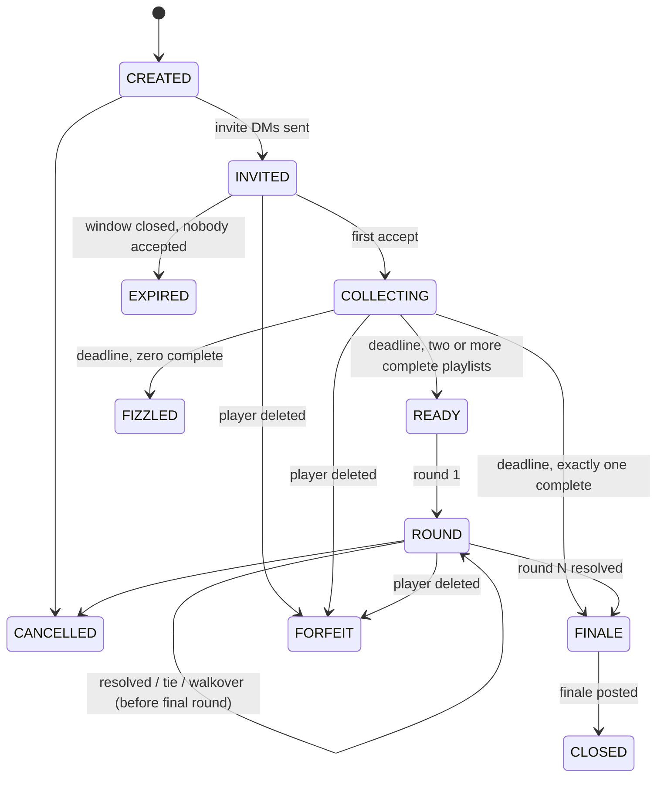

# Playlist Battle — Game Rules

Two to four players submit YouTube playlists, then vote in a round showdown across N rounds until a champion is crowned.

Rules are implemented as a pure domain layer — no I/O, no Mastodon, no DB:

| Rule area | Source of truth |
| --- | --- |
| Lifecycle states + legal transitions | `src/game/stateMachine.ts` |
| Create / accept / submit / finalize / resolve | `src/game/engine.ts` |
| Points, pot, standings, ties | `src/game/scoring.ts` |
| Eligibility, round collision detection | `src/game/types.ts` |
| Rate limits | `src/game/rateLimit.ts` |
| Round emission (poll / auto-tie / walkover) | `src/scheduler/roundState.ts` |
| Command syntax | `src/handlers/commands.ts` |
| Player-facing copy (EN / pt-BR) | `src/i18n/index.ts` |
| Tunable windows and limits | `src/config.ts` (see README §Configuration) |

## 1. Entry constraints

| Rule | Value |
| --- | --- |
| Players | 2–4 total (host + 1–3 challengers). The cap is Mastodon's 4 poll options |
| Playlist length N | 8–12 tunes, fixed at creation |
| Instance | Same-instance only — every player must be local, since polls do not count remote votes |
| Duplicates | The same account twice (or a challenger equal to the host) is rejected; the same video twice inside your own playlist is rejected |
| Entry | `@bot newgame "<theme>" 8–12 @challenger…` as a public mention. The host is auto-accepted. Themes are limited to 120 characters. |
| Challenger reply | DM `accept` or `decline` |
| Submission | DM one YouTube link per line; line order is the play order; re-submit freely until all accepted playlists are complete, at which point the duel locks and starts; DM `replace <n> <url>` swaps tune n before the lock (last write wins) |
| Rate limits | 10-minute creation cooldown per host; max 3 concurrent non-terminal games per player (as host or participant) |

## 2. Windows

| Window | Env var | Default |
| --- | --- | --- |
| Acceptance (challengers reply) | `ACCEPTANCE_WINDOW_SEC` | 24 h |
| Submission (playlists) | `SUBMISSION_WINDOW_SEC` | 48 h |
| Poll duration (global, manager-set) | `POLL_DURATION_SEC` | 15 min, clamped to 5 min–7 days |

Worst-case game length is `acceptance + submission + (N × (poll + replacement)) + scheduling overhead` (N = 12 max playlist length, overhead = 2 extra poll durations). If the instance auto-delete window (`AUTO_DELETE_WINDOW_HOURS`) is shorter than that, the bot logs a loud warning at boot — posts can vanish mid-duel and the game will break.

## 3. Duel mechanics

- **Rounds = N.** Round $k$ plays each eligible player's tune #$k$. Each round is a public, single-choice poll posted down a thread: round announce → one tune post per player → the poll. Anyone on the instance may vote, including players for their own tunes. The round announce asks voters to pick the song that best fits the theme. Poll option order is shuffled per round (deterministic seed = hash(gameId + round)); announce and tune posts keep player-labeled attribution.
- **Scoring.** Every vote is one permanent point for that tune's player. A strict winner of the round also takes the **pot** as a bonus, and the pot resets to 0.
- **Tie.** Two or more players sharing the top vote count — or everyone at zero — is a tie: no winner, **pot +1**, carried into the next round.
- **Quorum.** A poll with fewer than 3 total votes is scored as a tie (pot +1), even if one option leads 1–0 or 2–0.
- **Auto-tie.** If two or more players field the same canonical video ID in a round, no poll is created at all: the round is scored as a tie and the pot grows by 1.
- **Walkover.** If only one player remains eligible for a round, they win unopposed and take the pot — no poll. Walkovers may only result from round-level forfeits (unavailable video), never from player disappearance. A zero-participant mid-game round preserves the pot (it can only grow via ties); only the finale zeroes a leftover pot.
- **Incomplete playlist** ($m < N$ at the deadline). The playlist is valid only if complete: the player withdraws (treated exactly as a non-submitter). The duel starts only among complete playlists. Future-deadline partials are preserved across restarts; the withdrawal rule is applied when the submission deadline is reached.
- **Unavailable videos.** When a round is prepared, each tune is re-checked live (never served from cache). An unplayable tune DMs its player a replacement window lasting until the round post is published (minimum `REPLACEMENT_GRACE_MIN` minutes). Both forms are accepted while that window is open: a plain link, or `replace <n> <url>` with `n` = the current round. When a player has replacement windows in multiple games, reply to the specific replacement notice; ambiguous commands are rejected. No valid replacement in time → the player forfeits that round only (excluded from the poll; one remaining player = walkover). An unreachable player during replacement falls through to FORFEIT precedence below.

## 4. Ending states

| Outcome | Trigger |
| --- | --- |
| Champion | Highest total points after round N, among the players who actually dueled — a withdrawn (incomplete or non-submitting) player stays at 0 points and is never crowned |
| Shared championship | Exact points tie at the top |
| Pot split | A tied final round divides the pre-round pot equally among the tied players (integer division, remainder discarded; announced in the finale) — the pot never grows on a final tie. If the tie is quorum-forced (fewer than 3 votes) with a unique leader, *every* poll participant shares the pot, not just the leader. A final round that yields no eligible poll participants zeroes the pot |
| Default win | Exactly one complete playlist at the submission deadline — no duel, straight to FINALE |
| FIZZLED | Zero complete playlists at the deadline (partials withdraw) |
| EXPIRED | No challenger accepted within the acceptance window |
| FORFEIT | A player account was deleted or became unreachable — closed with no champion. Precedence: deletion always causes FORFEIT (no champion), even if it would leave exactly one eligible player; walkovers never result from player disappearance. A still-open round poll is closed and its poll status removed, so no votes can land on a void game |
| CANCELLED | The host DM'd `cancel` while the game was open — voids the game: no champion, no pot; scores are historical record only. Any live round poll is closed and its poll status removed, so no votes can land on a void game. Cancellable states are exactly the machine's `CANCEL` sources: CREATED, INVITED, COLLECTING, ROUND (a READY game is mid-transition and a FINALE game is already posting its outcome) |

The finale is a new thread root: summary, final standings, one link to the whole battle — the round winners in play order, published as a saved YouTube Music playlist when the bot account is configured (`YT_COOKIE`), otherwise as an anonymous YouTube queue — then one post per round-winning tune, and the champion mention. The game then moves to `CLOSED`.

## 5. Lifecycle

## 6. Commands

| Where | Command |
| --- | --- |
| Public reply/mention | `@bot newgame "<theme>" 8–12 @challenger [@challenger…]` |
| Public | `@bot status` |
| DM | `accept` / `decline` |
| DM | One YouTube link per line (playlist order = play order); plain link during a replacement window replaces the round's tune |
| DM | `replace <n> <url>` — swap tune n before the submission deadline, or the current round's tune while its replacement window is open |
| DM | `cancel` — host voids an open game (no champion, no pot; scores are historical record only) |

All player-facing copy is bilingual (`LOCALE=en` or `pt-BR`). See README §Commands for the abbreviated table and §Configuration for the full env reference.
