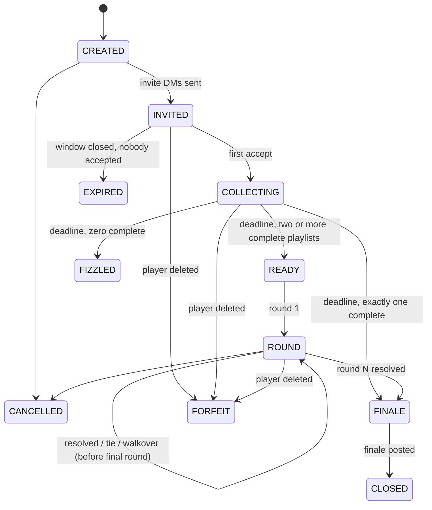

# Playlist Battle — Game Rules

Two to four players submit YouTube playlists, then vote in a round showdown across N rounds until a champion is crowned.

Rules are implemented as a pure domain layer — no I/O, no Mastodon, no DB:

| Rule area | Source of truth |
| --- | --- |
| Lifecycle states + transitions | `src/game/types.ts` (states), `src/game/engine.ts` (transitions), `src/handlers/closure.ts` (cancel / forfeit) |
| Create / accept / submit / finalize / resolve | `src/game/engine.ts` |
| Points, pot, standings, ties | `src/game/scoring.ts` |
| Eligibility, round collision detection | `src/game/types.ts` |
| Rate limits | `src/game/rateLimit.ts` |
| Merit: badges, win streaks, board ranking | `src/game/merit.ts` (pure), `src/db/merit.ts` (snapshot + queries) |
| Round emission (poll / auto-tie / walkover) | `src/scheduler/roundState.ts` |
| Command syntax | `src/handlers/commands.ts` |
| Player-facing copy (EN / pt-BR) | `src/i18n/index.ts` |
| Tunable windows and limits | `src/config.ts` (see README §Configuration) |

## 1. Entry constraints

| Rule | Value |
| --- | --- |
| Players | 2–4 total (host + 1–3 challengers). The cap is Mastodon's 4 poll options |
| Playlist length N | 8–12 tunes, fixed at creation |
| Instance | Same-instance or federated — any account may host, play, or vote (Mastodon counts remote poll votes) |
| Duplicates | The same account twice (or a challenger equal to the host) is rejected; the same video twice inside your own playlist is rejected |
| Entry | `@bot newgame "<theme>" 8–12 @challenger…` as a public mention. The host is auto-accepted. Themes are limited to 120 characters. |
| Challenger reply | DM `accept` or `decline` |
| Submission | DM one YouTube link per line; line order is the play order; re-submit freely until all accepted playlists are complete, at which point the duel locks and starts; DM `replace <n> <url>` swaps tune n before the lock (last write wins) |
| Rate limits | 10-minute creation cooldown per host; max 3 concurrent non-terminal games per player (as host or participant) |

## 2. Windows

| Window | Env var | Default |
| --- | --- | --- |
| Acceptance (challengers reply) | `ACCEPTANCE_WINDOW_SEC` | 24 h |
| Submission (playlists) | `SUBMISSION_WINDOW_SEC` | 48 h |
| Poll duration (global, manager-set) | `POLL_DURATION_SEC` | 15 min, clamped to 5 min–7 days |

Worst-case game length is `acceptance + submission + (N × (poll + replacement)) + scheduling overhead` (N = 12 max playlist length, overhead = 2 extra poll durations). If the instance auto-delete window (`AUTO_DELETE_WINDOW_HOURS`) is shorter than that, the bot logs a loud warning at boot — posts can vanish mid-duel and the game will break.

## 3. Duel mechanics

- **Rounds = N.** Round $k$ plays each eligible player's tune #$k$. Each round is a public, single-choice poll posted down a thread: round announce → one tune post per player → the poll. Anyone may vote, including remote accounts and players for their own tunes. The round announce asks voters to pick the song that best fits the theme. Poll option order is shuffled per round (deterministic seed = hash(gameId + round)); announce and tune posts keep player-labeled attribution.
- **Scoring.** Every vote is one permanent point for that tune's player. A strict winner of the round also takes the **pot** as a bonus, and the pot resets to 0.
- **Tie.** Two or more players sharing the top vote count — or everyone at zero — is a tie: no winner, **pot +1**, carried into the next round.
- **Quorum.** A poll with fewer than 3 total votes is scored as a tie (pot +1), even if one option leads 1–0 or 2–0.
- **Auto-tie.** If two or more players field the same canonical video ID in a round, no poll is created at all: the round is scored as a tie and the pot grows by 1.
- **Walkover.** If only one player remains eligible for a round, they win unopposed and take the pot — no poll. Walkovers may only result from round-level forfeits (unavailable video), never from player disappearance. A zero-participant mid-game round preserves the pot (it can only grow via ties); only the finale zeroes a leftover pot.
- **Incomplete playlist** ($m < N$ at the deadline). The playlist is valid only if complete: the player withdraws (treated exactly as a non-submitter). The duel starts only among complete playlists. Future-deadline partials are preserved across restarts; the withdrawal rule is applied when the submission deadline is reached.
- **Unavailable videos.** When a round is prepared, each tune is re-checked live (never served from cache). An unplayable tune DMs its player a replacement window lasting until the round post is published (minimum `REPLACEMENT_GRACE_MIN` minutes). Both forms are accepted while that window is open: a plain link, or `replace <n> <url>` with `n` = the current round. When a player has replacement windows in multiple games, reply to the specific replacement notice; ambiguous commands are rejected. No valid replacement in time → the player forfeits that round only (excluded from the poll; one remaining player = walkover). An unreachable player during replacement falls through to FORFEIT precedence below.

## 4. Ending states

| Outcome | Trigger |
| --- | --- |
| Champion | Highest total points after round N, among the players who actually dueled — a withdrawn (incomplete or non-submitting) player stays at 0 points and is never crowned |
| Shared championship | Exact points tie at the top |
| Pot split | A tied final round divides the pre-round pot equally among the tied players (integer division, remainder discarded; announced in the finale) — the pot never grows on a final tie. If the tie is quorum-forced (fewer than 3 votes) with a unique leader, *every* poll participant shares the pot, not just the leader. A final round that yields no eligible poll participants zeroes the pot |
| Default win | Exactly one complete playlist at the submission deadline — no duel, straight to FINALE |
| FIZZLED | Zero complete playlists at the deadline (partials withdraw) |
| EXPIRED | No challenger accepted within the acceptance window |
| FORFEIT | A player account was deleted or became unreachable — closed with no champion. Precedence: deletion always causes FORFEIT (no champion), even if it would leave exactly one eligible player; walkovers never result from player disappearance. A still-open round poll is closed and its poll status removed, so no votes can land on a void game |
| CANCELLED | The host DM'd `cancel` while the game was open — voids the game: no champion, no pot; scores are historical record only. Any live round poll is closed and its poll status removed, so no votes can land on a void game. Cancellable states are exactly `CLOSURES.CANCEL` in `src/handlers/closure.ts`: CREATED, INVITED, COLLECTING, ROUND (a READY game is mid-transition and a FINALE game is already posting its outcome) |

The finale is a new thread root: summary, final standings, one link to the whole battle — the round winners in play order, published as a saved YouTube Music playlist when the bot account is configured (`YT_COOKIE`), otherwise as an anonymous YouTube queue — then one post per round-winning tune, and the champion mention. The game then moves to `CLOSED`.

## 5. Lifecycle

```mermaid
stateDiagram-v2
  [*] --> CREATED
  CREATED --> INVITED: invite DMs sent
  CREATED --> CANCELLED
  INVITED --> COLLECTING: first accept
  INVITED --> EXPIRED: window closed, nobody accepted
  COLLECTING --> READY: deadline, two or more complete playlists
  COLLECTING --> FINALE: deadline, exactly one complete
  COLLECTING --> FIZZLED: deadline, zero complete
  READY --> ROUND: round 1
  ROUND --> ROUND: resolved / tie / walkover (before final round)
  ROUND --> FINALE: round N resolved
  FINALE --> CLOSED: finale posted
  INVITED --> FORFEIT: player deleted
  COLLECTING --> FORFEIT: player deleted
  ROUND --> FORFEIT: player deleted
  ROUND --> CANCELLED
```

## 6. Commands

| Where | Command |
| --- | --- |
| Public reply/mention | `@bot newgame "<theme>" 8–12 @challenger [@challenger…]` |
| Public | `@bot status` |
| Public | `@bot ranking` (or `classificacao`) — the 30-day board plus the asker's position |
| Public | `@bot badges` (or `conquistas`) — the asker's own record |
| DM | `ranking` / `badges` — the same two views, privately |
| DM | `accept` / `decline` |
| DM | One YouTube link per line (playlist order = play order); plain link during a replacement window replaces the round's tune |
| DM | `replace <n> <url>` — swap tune n before the submission deadline, or the current round's tune while its replacement window is open |
| DM | `cancel` — host voids an open game (no champion, no pot; scores are historical record only) |

All player-facing copy is bilingual (`LOCALE=en` or `pt-BR`). See README §Commands for the abbreviated table and §Configuration for the full env reference.

## 7. Merit

Achievements and the leaderboard read a per-duel snapshot written once at the
finale, never an accumulator. Career totals are therefore always derivable, and
a badge can never drift from the games that earned it.

### 7.1 What counts

| Game status | Counts as | Why |
| --- | --- | --- |
| `CLOSED` | full | a real duel with a champion |
| `CANCELLED` | participation only | RULES §4: scores are historical record only; no champion, so no win |
| `EXPIRED` | nothing | no duel happened |
| `FIZZLED` | nothing | no complete playlist was ever submitted |
| `FORFEIT` | nothing | void |

Only players who actually dueled are recorded, matching the exclusion
`champions()` applies. A withdrawn player appears nowhere in the merit tables,
which is what keeps a re-derivation from crowning them.

Round wins come from `rounds WHERE status = 'resolved'`. `walkover` and
`auto_tied` also set a winner, and winning because an opponent forfeited is not
merit.

### 7.2 Badges

Every badge is awarded **once ever** — `badges` is keyed `(account_id, badge)`.
Tiers are distinct ids, so a 5-win run is a permanent high-water mark.

| id | Name (pt-BR / EN) | Earned by |
| --- | --- | --- |
| `debut` | Primeira Faixa / First Track | first duel |
| `plays_5` | Frequente na Pista / Deck Regular | 5 duels |
| `plays_25` | Lenda da Pista / Deck Legend | 25 duels |
| `completionist` | Setlist Inteiro / Full Setlist | a full-length playlist |
| `marathon` | Set Sem Fim / Endless Set | played through the final round |
| `first_blood` | Primeiro Hit / First Hit | first win |
| `hat_trick` | Trinca de Hits / Triple Hit | 3 consecutive wins |
| `on_a_run` | Flow Perfeito / Perfect Flow | 5 consecutive wins |
| `unstoppable` | Mix Incontrolável / Unstoppable Mix | 10 consecutive wins |
| `first_contact` | Primeiro Dueto / First Duel | beat someone on another instance |
| `wanderer` | Nômade de Gêneros / Genre Nomad | played across 3 instances |
| `durable` | Ouvido Fiel / Loyal Ear | 10 duels against 10 different opponents |
| `conductor` | DJ Residente / Resident DJ | first duel hosted |
| `promoter` | Agitador Cultural / Culture Promoter | 10 duels hosted |

`first_contact` and `wanderer` test the handle's domain as recorded at invite
time. That does not follow an account that later migrates instances, so the
badge means *where you met them*, not where they are now.

### 7.3 Win streaks

A streak is the longest run of consecutive wins among the duels an account
**played**, ordered by `closed_at` descending. A duel the account did not play
cannot break the run — a streak is a high-water mark, never something a break
in play takes back. Streak badges are awarded once and kept.

### 7.4 The board

- **Window:** rolling 30 days. An all-time board hands the top spot to whoever
  played most last month and it never moves, which ends the competition.
- **Floor:** 3 duels before an account appears. A 1-1 record must not outrank a
  9-2, so the floor applies to duels played, not to the ranked score. It is
  also why a young board reads "needs 3 duels" rather than naming a winner from
  a single game.
- **Cadence:** weekly, keyed by ISO week. A week with fewer than 2 closed duels
  or fewer than 3 distinct players is skipped — a board with nobody on it says
  the bot is alive while showing nobody anything.
- **Placement:** a reply into the most recent duel's thread, not a fresh root
  post. It reaches the people already following the game instead of
  broadcasting to every follower of a personal account.

### 7.5 Delivery

| Channel | What |
| --- | --- |
| Finale thread | One reply naming who unlocked what. Up to four mentions, so one notification per player — the mention is what carries it |
| DM | The same awards plus the running total. Best-effort: a refused DM never stops the duel closing |
| On demand | `@bot ranking` / `@bot badges`, public or by DM |

The finale writes merit, awards badges, and flips `FINALE → CLOSED` last, so a
resumed finale can still re-enter. The reply reads the badge ledger rather than
the award return value, because a replay finds nothing new to award.
